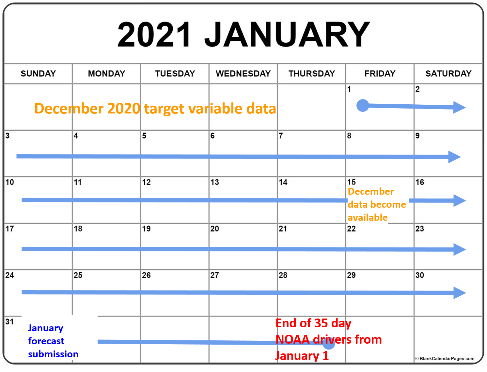

# Theme: Carbon and Water Fluxes

**What:** Net ecosystem exchange of CO2, evapotranspiration, and soil moisture

**Where**: 4 NEON sites that span a water stress gradient in the U.S. The images below show the flux tower at the center of each site.

**When:** Half hour and/or daily forecasts for a 35 day period are submitted once per month January 31-December 31, 2021; later submissions after the January 31 start are permissible

**Why:** Carbon and water cycling are fundamental for climate and water regulation services provided by ecosystems

**Who**: Open to any individual or team that registers

**How**: [REGISTER](https://nd.qualtrics.com/jfe/form/SV_9MJ29y2xNrBOjqZ) your team and submit forecast

We held a Q&A session on January 22, 2021. You can find a recording from that session [HERE](https://www.youtube.com/watch?v=3rOVlAX9YH8&feature=youtu.be).

## Overview

The exchange of water and carbon dioxide between the atmosphere and the land is akin to earth’s terrestrial ecosystems breathing rate and lung capacity. The water available to plant roots plays a critical role in plant function, and subsequently represents a predominant source of uncertainty for predictions of how much carbon is entering or exiting an ecosystem. One of the best ways to monitor changes in the amount of carbon and water in an ecosystem is the eddy-covariance method. This method observes the net amount of carbon and water entering and exiting ecosystems at half-hourly timesteps, which is important because it can provide information on ecosystem processes such as photosynthesis, respiration, and transpiration, their sensitivities to ongoing climate and land use change, and greenhouse gas budgets for carbon accounting and natural climate solutions. Forecasts of carbon uptake and release, water use, and soil moisture can provide insights into future production of food, fiber, timber, and carbon credits. Additionally, forecasts will highlight the influence that stress and disturbance have on carbon and water cycling.

## Challenge 

This design challenge asks teams to produce forecasts of net ecosystem exchange of carbon dioxide (NEE), latent heat flux of evapotranspiration (LE), and soil moisture across four NEON sites with differing climates. These target variables are important because they can be used to inform energy budgets and further reduce uncertainty in the CO2 sink or source behavior of the terrestrial biosphere. 
This forecasting challenge asks teams to forecast NEE, LE, and soil moisture at either the 30-minute or daily time step over the next 35-days using NOAA Global Ensemble Forecast System weather forecasts as drivers (if forecasting model uses meteorological inputs). Monthly forecasts can be submitted for each month in 2021. The challenge will take place using the eddy covariance flux towers at 4 NEON sites: Bartlett Experimental Forest (BART), Konza Prairie Biological Station (KONZ), Ordway-Swisher Biological Station (OSBS), and Santa Rita Experimental Range (SRER). 

Users are asked to submit their forecast of measured NEON NEE, LE, and soil moisture data, along with uncertainty estimates and metadata. Any NEE, LE, and soil moisture data prior to the month being forecasted may be used to build and improve the models used to generate forecasts. Other data can be used so long as they are not from the month being forecast and the data are made publicly available (minimum of URL, but ideally a script) and accessible to all teams in the challenge.

## Data: Targets 

The challenge uses the following NEON data products:  

[DP4.00200.001](https://data.neonscience.org/data-products/DP4.00200.001): Bundled data products - eddy covariance   
[DP1.00094.001](https://data.neonscience.org/data-products/DP1.00094.001): Soil water content and water salinity  

A file with previously released NEON data that has been processed into “targets” is provided below. The same processing will be applied to new data that are used for forecast evaluation. Before the Terrestrial Carbon and Water Flux challenge begins, a processing script will be available in the neon4cast-terrestrial GitHub repository.

### Net ecosystem exchange

**Definition**

Net ecosystem exchange (NEE) is the net movement of carbon dioxide from the atmosphere to the ecosystem.  At the 30-minute time resolution is reported as $\mu$mol CO<sub>2</sub> m<sup>-2</sup> s<sup>-1</sup>.  At the daily time resolution it is reported as g C m<sup>-2</sup> day<sup>-1</sup>. Negative values correspond to an ecosystem absorbing CO<sup>2</sup> from the atmosphere, positive values correspond to an ecosystem emitting CO<sub>2</sub> to the atmosphere.

**Motivation**

NEE quantifies the net exchange of CO<sub>2</sub> between the ecosystem and the atmosphere over that 30-minute or daily time period.  Assessing skill at predicting 1/2 hourly - sub daily measurements provides more insight into ability to capture diel processes. The diel curve contains information on how plants and soil immediately respond to variations in meteorology. 

Making daily predictions will allow us to rapidly assess skill and provide information in a timeframe pertinent to inform and implement natural resource management. It also allows for models that do not produce sub-daily estimates to participate

### Latent heat flux

**Definition**

Latent heat flux is the movement of water as water vapor from the ecosystem to the atmosphere.  It is reported as W m<sup>-2</sup> (equivalent to J m<sup>-2</sup> s<sup>-1</sup>).  At the daily time resolution it is reported as g H2O m<sup>-2</sup> day<sup>-1</sup>. Positive values correspond to a transfer of water vapor from the ecosystem to the atmosphere.

**Motivation**

Latent heat measures the water loss from an ecosystem to the atmosphere through evapotranspiration (transpiration through plants + evaporation from surfaces).  

Forecasting latent heat (evapotranspiration) can provide insights to water stress for plants and the efficiency that plants are using water relative to NEE, and to the amount of liquid water remaining in the soil for soil moisture forecasting

### Soil moisture

**Definition**

Volumetric soil water content integrated at one station (station 3) at 15 cm depth.  It is reported as a proportion of water volume to soil volume.

**Motivation**

Volumetric water content is the measurement of water availability in soil.   This water can be transpired during photosynthesis by plants.  Forecasts of volumetric water content can provide insights into water stress for plants.

### Focal sites

| Site Name       | SiteID     | NEON Domain     | Latitude  |  Longitude | Dominant Species |
| :------------- | :----------: | -----------: | -----------: | -----------: | -----------: |
|  [Bartlett Experimental Forest, NH](https://www.neonscience.org/field-sites/bart) | BART  | D01: Northeast    | 44.0639 | -71.2874 | *Fagus grandifolia*, *Tsuga canadensis*, *Acer pensylvanicum* | 
|  [Ordway Swisher Biological Station, FL](https://www.neonscience.org/field-sites/osbs) | OSBS  | D03: Southeast    | 31.91068 | -81.99343 | Herbaceous and woody wetlands, Evergreen forest | 
|  [Konza Prairie Biological Station, KS](https://www.neonscience.org/field-sites/konz)  | KONZ  | D06: Prairie Peninsula    | 39.10077 | -96.56309 | Midwestern tallgrass prairie | 
|  [Santa Rita Experimental Range, AZ](https://www.neonscience.org/field-sites/srer) | SRER  | D14: Desert Southwest    | 31.91068 | -110.83549 | Southwest desert shrub/scrub | 

All sites are near Ameriflux sites that could be used when developing the models if the data are publicly available in the Ameriflux database.  If Ameriflux data is used, teams MUST follow Ameriflux data use policy (which is different from NEON’s) 

**Bartlett**   
  - [US-Bar: Bartlett Experimental Forest (2004-2017)](https://ameriflux.lbl.gov/sites/siteinfo/US-Bar)   

**Konza**  
- [US-Kon: Konza Prairie LTER (KNZ) (2004-2019)](https://ameriflux.lbl.gov/sites/siteinfo/US-Kon)    
- [US-KFB: Konza Prairie LTER (4B) (2006-present)](https://ameriflux.lbl.gov/sites/siteinfo/US-KFB)   

**Santa Rita**   
- [US-SRC: Santa Rita Creosote (2008-2018, physically closest tower to the NEON tower)](https://ameriflux.lbl.gov/sites/siteinfo/US-SRC)      
- [US-SRG: Santa Rita Grassland (2008-2019)](https://ameriflux.lbl.gov/sites/siteinfo/US-SRG)   
- [US-SRM: Santa Rita Mesquite (2003-2019)](https://ameriflux.lbl.gov/sites/siteinfo/US-SRM)   
- [US-SRS: Santa Rita Experimental Range Mesquite Savanna (2011-2019)](https://ameriflux.lbl.gov/sites/siteinfo/US-SRS)   

**Ordway-Swisher**   
- [US-SP1: Slashpine-Austin Cary- 65yrs nat regen (2000-2011)](https://ameriflux.lbl.gov/sites/siteinfo/US-SP1)   
- [US-SP2: Slashpine-Mize-clearcut-3yr,regen (1998-2008)](https://ameriflux.lbl.gov/sites/siteinfo/US-SP2)   
- [US-SP3: Slashpine-Donaldson-mid-rot- 12yrs (1999 - 2010)](https://ameriflux.lbl.gov/sites/siteinfo/US-SP3)   
- [US-SP4: Slashpine-Rayonier-mid-rot- 12yrs (1998)](https://ameriflux.lbl.gov/sites/siteinfo/US-SP4)   


### 30-minute target data calulation

To create the data for evaluation (and training) for NEE and LE we extract NEE and LE that pass the turbulence quality control flags (`qfqm.fluxCo2.turb.qfFinl` and `qfqm.fluxH2o.turb.qfFinl` = 0) provided by NEON.   To calculate depth integrated soil moisture (VSWC) for the half-hourly, we used the depth of each sensor. The midpoints between each sensor were used to calculate the proportion of the depth profile each sensor occupied. Soil moisture values from each sensor were weighted by the proportion of the depth profile, then summed to generate the target variable.


The table with the half-hour NEE, LE, and VSWC has the following columns

- `siteID`: NEON site code (e.g., BART)     
- `time`: YYYY-MM-DD HH:MM for the start of the 30-minute period in UTC   
- `nee`:  umol CO2 m-2 s-1   
- `le`: W m-2   
- `vswc`: (%)   
- `nee_sd_intercept`: intercept in the nee observation uncertainty standard deviation   
- `nee_sd_slopeP`: slope in the relationship between nee and observation uncertainty standard deviation for positive values of nee   
- `nee_sd_slopeN`: slope in the relationship between nee and observation uncertainty standard deviation for negative values of nee   
- `le_sd_intercept`: intercept in the le observation uncertainty standard deviation   
- `le_sd_slopeP`:slope in the relationship between le and observation uncertainty standard deviation for positive values of le  
- `le_sd_slopeN`: slope in the relationship between le and observation uncertainty standard deviation for negative values of le   
- `vswc_sd`:  observation uncertainty standard deviation vswc  

The observation uncertainty estimates for nee and le are derived from the PECAN project and can be used by `sd_nee <- nee_sd_intercept + nee_sd_slopeP * nee`.  They are not supplied by NEON.

The standard derivation for the vswc (`vswc_sd`) is the uncertainty reported by NEON.

Here is the format of the target file

```{r message = FALSE}
readr::read_csv("https://data.ecoforecast.org/targets/terrestrial/terrestrial_30min-targets.csv.gz", guess_max = 1e6)
```

### Daily target data calulation

To evaluate the models that produce daily flux forecasts, we select only days with at least 44 of 48 half hours that pass the quality control flags.  For these days, we average the half-hours and convert to daily units (gC/m2/day).  The daily data table has the following columns.

- `siteID`: NEON site code (e.g., BART)  
- `time`: YYYY-MM-DD (the day is determined using UTC time)  
- `nee`: g C m-2 day-1  
- `le`:  g H2O m-2 day-1  
- `vswc`: (%)  
- `vswc_sd`: observation uncertainty standard deviation vswc  

NEED TO ADD WHERE vswc_sd comes from

```{r message = FALSE}
readr::read_csv("https://data.ecoforecast.org/targets/terrestrial/terrestrial_daily-targets.csv.gz", guess_max = 1e6)
```

The R script for generating the evaluation and training data can be found at: https://github.com/eco4cast/neon4cast-terrestrial

## Timeline

The timeline is determined by the data latency provided by NEON. NEON data is released in month long sets, 2 weeks after the month ends. 

The challenge will begin January 31, 2021 at 11:59 Eastern Standard Time (UTC−05:00) and run through December 31, 2021. Subsequent forecasts are due at 11:59 EST on the final day of each month.

NEON data for a given month is scheduled to be released around the 15th of the following month. Once the NEON data for a previous month is released, teams have between the release of those data to the end of the month to forecast the current month. 

For example, NEON eddy-covariance data area will be released on January 15 that contains values for December 1 - 31. Teams can use these December eddy-covariance data to help generate forecasts from Jan 1 - February 5 (35 days). This January forecast is due by 11:59 pm EST on January 31. The forecast issue date for the January forecast is January 1, so no new observational data from after that date can be used to constrain forecasts and the forecast should use the weather forecast issued at midnight January 1 (i.e. start of day) as the driver (not the observed meteorology in January or forecasts made at later dates). See the calendar below for a visual depiction of the data availability and forecast submission timeline.



Evaluation will occur as new NEON data is released. 

## Design team 

Alex Young, SUNY - College of Environmental Science & Forestry  
George Burba, LI-COR Biosciences  
Jamie Cleverly, Terrestrial Ecosystem Research Network (TERN)   
Ankur Desai, University of Wisconsin, Madison   
Mike Dietze, Boston University   
Andy Fox, Joint Center for Satellite Data Assimilation   
William Hammond, Oklahoma State University  
Danica Lombardozzi, National Center for Atmospheric Research   
Quinn Thomas, Virginia Tech  

## Partners

Data used in the challenge are from the National Ecological Observatory Network ([NEON](https://www.neonscience.org/))

[Ameriflux](https://ameriflux.lbl.gov/) is an excellent database of eddy-covariance data, including historical data for some of the four challenge sites.

Terrestrial Ecosystem Research Network [(TERN)](https://www.tern.org.au/) has been involved in the design of the challenge: 

## References 
