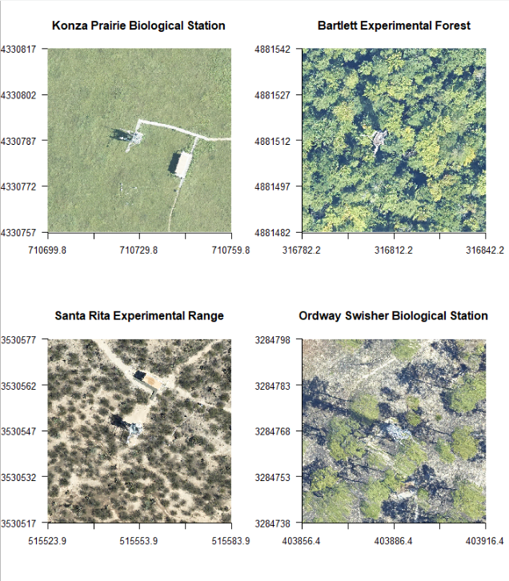

# Theme: Carbon and Water Fluxes

**What:** Net ecosystem exchange of CO2, evapotranspiration, and soil moisture

**Where**: 4 NEON sites that span a water stress gradient in the U.S. The images below show the flux tower at the center of each site.

**When:** Half hour and/or daily forecasts for a 35 day period are submitted once per month January 31-December 31, 2021; later submissions after the January 31 start are permissible

**Why:** Carbon and water cycling are fundimental for climate and water regulation services provided by ecosystems

**Who**: Open to any individual or team that registers

**How**: REGISTER your team and submit forecast

We held a Q&A session on January 22, 2021. You can find a recording from that session [HERE](https://www.youtube.com/watch?v=3rOVlAX9YH8&feature=youtu.be).

## Overview

The exchange of water and carbon dioxide between the atmosphere and the land is akin to earth’s terrestrial ecosystems breathing rate and lung capacity. The water available to plant roots plays a critical role in plant function, and subsequently represents a predominant source of uncertainty for predictions of how much carbon is entering or exiting an ecosystem. One of the best ways to monitor changes in the amount of carbon and water in an ecosystem is the eddy-covariance method. This method observes the net amount of carbon and water entering and exiting ecosystems at half-hourly timesteps, which is important because it can provide information on ecosystem processes such as photosynthesis, respiration, and transpiration, their sensitivities to ongoing climate and land use change, and greenhouse gas budgets for carbon accounting and natural climate solutions. Forecasts of carbon uptake and release, water use, and soil moisture can provide insights into future production of food, fiber, timber, and carbon credits. Additionally, forecasts will highlight the influence that stress and disturbance have on carbon and water cycling.

## Challenge 

This design challenge asks teams to produce forecasts of net ecosystem exchange of carbon dioxide (NEE), latent heat flux of evapotranspiration (LE), and soil moisture across four NEON sites with differing climates. These target variables are important because they can be used to inform energy budgets and further reduce uncertainty in the CO2 sink or source behavior of the terrestrial biosphere. 
This forecasting challenge asks teams to forecast NEE, LE, and soil moisture at either the 30-minute or daily time step over the next 35-days using NOAA Global Ensemble Forecast System weather forecasts as drivers (if forecasting model uses meteorological inputs). Monthly forecasts can be submitted for each month in 2021. The challenge will take place using the eddy covariance flux towers at 4 NEON sites: Bartlett Experimental Forest (BART), Konza Prairie Biological Station (KONZ), Ordway-Swisher Biological Station (OSBS), and Santa Rita Experimental Range (SRER). 

Users are asked to submit their forecast of measured NEON NEE, LE, and soil moisture data, along with uncertainty estimates and metadata. Any NEE, LE, and soil moisture data prior to the month being forecasted may be used to build and improve the models used to generate forecasts. Other data can be used so long as they are not from the month being forecast and the data are made publicly available (minimum of URL, but ideally a script) and accessible to all teams in the challenge.

Submissions of forecast and metadata will be through https://data.ecoforecast.org/minio/submissions/ using prescribed file formats described in the challenge theme documentation

Forecasts will be scored and compared using the Continuous Ranked Probability Score, a metric that combines accuracy and uncertainty estimation (Gneiting, T., & Raftery, A. E., 2007). 

## Data: Training and Evaluation 

The challenge uses the following NEON data products:
DP4.00200.001: Bundled data products - eddy covariance
DP1.00094.001: Soil water content and water salinity

## Data: Targets

A file with previously released NEON data that has been processed into “targets” is provided below. The same processing will be applied to new data that are used for forecast evaluation. Before the Terrestrial Carbon and Water Flux challenge begins, a processing script will be available in the neon4cast-terrestrial GitHub repository.

## Detailed Protocol

Details of the targets, how they are calculated, descriptions of the target files, and examples of other environmental variables that could be used in the Challenge are HERE. 

Access Targets HERE

Download an example of a forecast output format for submission using ensemble members to describe uncertainity HERE

## Timeline

The timeline is determined by the data latency provided by NEON. NEON data is released in month long sets, 2 weeks after the month ends. 

The challenge will begin January 31, 2021 at 11:59 Eastern Standard Time (UTC−05:00) and run through December 31, 2021. Subsequent forecasts are due at 11:59 EST on the final day of each month.

NEON data for a given month is scheduled to be released around the 15th of the following month. Once the NEON data for a previous month is released, teams have between the release of those data to the end of the month to forecast the current month. 

For example, NEON eddy-covariance data area will be released on January 15 that contains values for December 1 - 31. Teams can use these December eddy-covariance data to help generate forecasts from Jan 1 - February 5 (35 days). This January forecast is due by 11:59 pm EST on January 31. The forecast issue date for the January forecast is January 1, so no new observational data from after that date can be used to constrain forecasts and the forecast should use the weather forecast issued at midnight January 1 (i.e. start of day) as the driver (not the observed meteorology in January or forecasts made at later dates). See the calendar below for a visual depiction of the data availability and forecast submission timeline.

Evaluation will occur as new NEON data is released. 

## Design team 

Alex Young, SUNY - College of Environmental Science & Forestry  
George Burba, LI-COR Biosciences  
Jamie Cleverly, Terrestrial Ecosystem Research Network (TERN)   
Ankur Desai, University of Wisconsin, Madison   
Mike Dietze, Boston University   
Andy Fox, Joint Center for Satellite Data Assimilation   
William Hammond, Oklahoma State University  
Danica Lombardozzi, National Center for Atmospheric Research   
Quinn Thomas, Virginia Tech  

## Partners

The challenge is hosted by the Ecological Forecasting Initiative (EFI; https://ecoforecast.org/) and its U.S. National Science Foundation-sponsored Research Coordination Network (EFI-RCN; https://ecoforecast.org/rcn/).

Data used in the challenge are from the National Ecological Observatory Network (NEON): https://www.neonscience.org/. 

Ameriflux is an excellent database of eddy-covariance data, including historical data for some of the four challenge sites: https://ameriflux.lbl.gov/.

Terrestrial Ecosystem Research Network (TERN) has been involved in the design of the challenge: https://www.tern.org.au/.

## References 

Gneiting, T., & Raftery, A. E. (2007). Strictly proper scoring rules, prediction, and estimation. Journal of the American Statistical Association, 102(477), 359–378. https://doi.org/10.1198/016214506000001437
