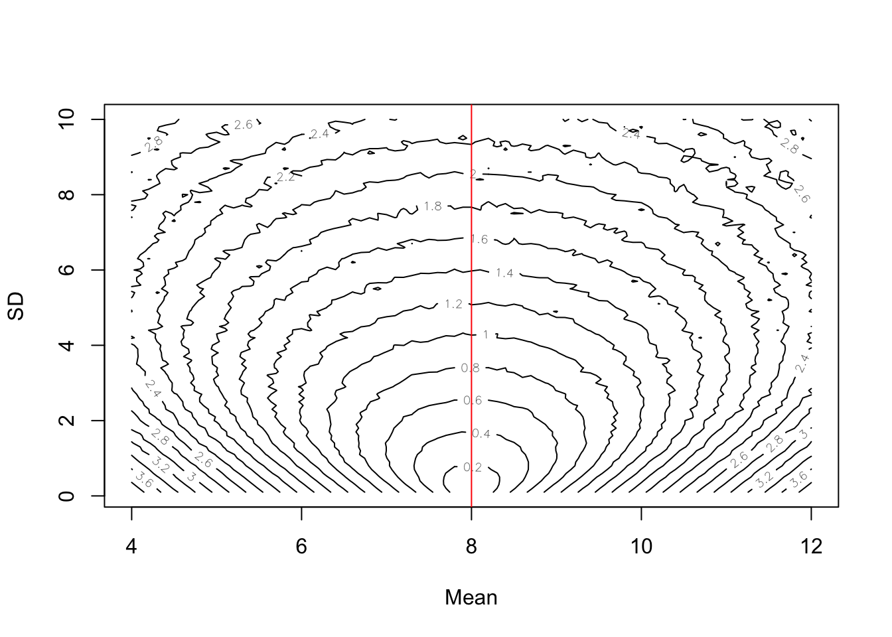
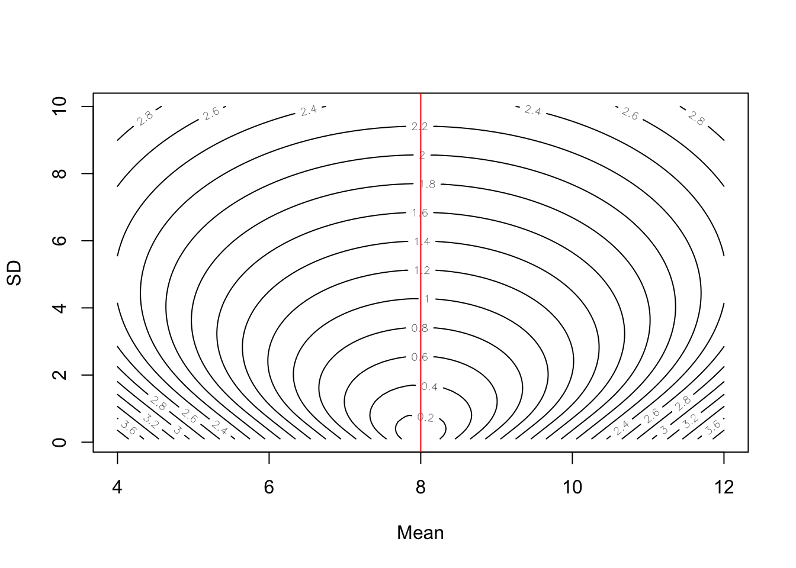
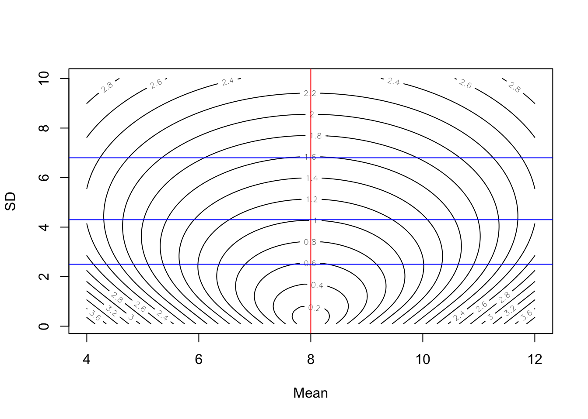
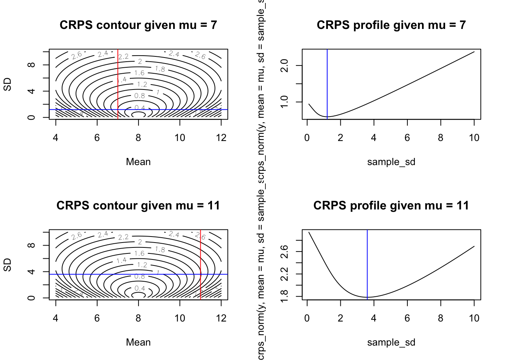

# Evaluation

Forecasts will be evaluated at each site and forecast horizon (i.e., time-step into the future), and a summary score will be assigned evaluating overall performance of all forecast submissions across sites.  Forecasts will also be compared to a null model.

Forecast evaluation results will be presented for all submitted models together and separately for each team category: undergraduate student only team, graduate student only team, post-doc only team, single institution team, multi-institution team, international team (team with individuals from at least two countries).

## Results

Preliminary results will be distributed using the NEON Ecological Forecast Challenge Output RShiny app and at https://data.ecoforecast.org/minio/scores/. We intend to write a joint manuscript synthesizing forecasts. Teams are welcome to publish results from their model at any time. If a publication is generated we encourage the manuscript to acknowledge the Ecological Forecasting Research Coordination Network and its support from the National Science Foundation (DEB-1926388).

## Scoring Metric: Continuous Ranked Probability Score

Forecasts will be scored using the continuous ranked probability score (CRPS), a proper scoring rule for evaluating forecasts presented as distributions or ensembles (Gneiting & Raftery 2007). The CRPS compares the forecast probability distribution to that of the validation observation and assigns a score based on both the accuracy and precision of the forecast. We will use the 'crps_sample' function from the `scoringRules` package in R to calculate the CRPS for each forecast. 

We will generate a combined score for all locations and forecast horizons. Forecasts will also be evaluated using the CRPS at each time-step in the forecast horizon and each location included in the forecasts.


### Example of a CRPS calculation from an ensemble forecast

The following uses Equation 2 in Jordan, Kruger, and Lerch 2018


First, create a random sample from a probability distribution. This is the "forecast" for a particular point in time. For simplicity, we will use a normal distribution with a mean of 8 and standard deviation of 1


```r
x <- rnorm(1000, mean = 8, sd = 1.0)
```

Second, we have our data point (i.e., the target).  We will set it to zero as well


```r
y <- 8
```

Now calculate CRPS using Equation 2


```r
s <- 0
for(i in 1:length(x)){
  for(j in 1:length(x)){
    s <- s + abs(x[i] - x[j])
  }
}
crps_equation_2 <- mean(abs(x - y)) - s / (2 * length(x)^2)
crps_equation_2
```

```
## [1] 0.2314336
```

Now calculate using the `crps_sample()` function in the `scoringRules` package


```r
crps_sample(y = y, dat = x)
```

```
## [1] 0.2314336
```

### Exploring the scoring surface

Now lets see how the CRPS changes as the mean and standard deviation of the forecasted distribution change

First, set vectors for the different mean and SD values we want to explore


```r
sample_mean <- seq(4, 12, 0.1)
sample_sd <- seq(0.1, 10, 0.1)
```

Second, set our observed value to 8 for simplicity


```r
y <- 8
```

Now calculate the CRPS at each combination of forest mean and SD


```r
combined <- array(NA, dim = c(length(sample_mean), length(sample_sd)))
for(i in 1:length(sample_mean)){
  for(j in 1:length(sample_sd)){
    sample <- rnorm(10000, sample_mean[i], sample_sd[j])
    combined[i, j] <- crps_sample(y = y, dat = sample)
  }
}
```

Finally, visualize the scoring surface with the observed value represented by the red line


```r
contour(x = sample_mean, y = sample_sd, z = as.matrix(combined),nlevels = 20, xlab = "Mean", ylab = "SD")
abline(v = y, col = "red")
```



The contour surface highlights the trade-off between the mean and standard deviation.

### CRPS from the Normal Distribution

If the distributional forecast is a normal distribution represented by a mean $\mu$ and standard deviation $\sigma$, an ensemble of predictions is not needed to evaluate CRPS because we can take advantage of the analytic solution to CRPS under the normal assumption (Equation 4 from [Calibrated Probabilistic Forecasting Using Ensemble Model Output Statistics and Minimum CRPS Estimation](https://doi.org/10.1175/MWR2904.1)). 

Equation 5 from [Calibrated Probabilistic Forecasting Using Ensemble Model Output Statistics and Minimum CRPS Estimation](https://doi.org/10.1175/MWR2904.1) gives

$$\begin{align*}
CRPS(N(\mu, \sigma^2) | y) = \sigma \left( \frac{y - \mu}{\sigma} \left( 2 \Phi\left(  \frac{y - \mu}{\sigma} \right) - 1 \right)  + 2 \phi \left(  \frac{y - \mu}{\sigma} \right) - \frac{1}{\sqrt{\pi}} \right)
\end{align*}$$

for $\Phi(\cdot)$ and $\phi(\cdot)$ the standard normal CDF and PDF, respectively. Therefore, if the forecast distribution is **truly** a normal distribution (often this isn't true in forecasts that only report a mean and sd) a simplified score can be applied as follows:


```r
sample_mean <- seq(4, 12, 0.1)
sample_sd <- seq(0.1, 10, 0.1)

combined_norm <- array(NA, dim = c(length(sample_mean), length(sample_sd)))
for(i in 1:length(sample_mean)){
  for(j in 1:length(sample_sd)){
    combined_norm[i, j] <- crps_norm(y = y, mean = sample_mean[i], sd = sample_sd[j])
  }
}
```

Finally, visualize the scoring surface with the observed value represented by 
the red line


```r
contour(x = sample_mean, y = sample_sd, z = as.matrix(combined_norm), nlevels = 20, xlab = "Mean", ylab = "SD")
abline(v = y, col = "red")
```



Note that at a given value of the sd, the lowest score is achieved at $\mu = y$ as shown for each of the blue lines where the minmum value of the score across each blue line is at the red line. This behavior make sense because the CRPS is a score that reward accuracy and precision. Thus, for any given level of precision (represented by the standard deviation), CRPS is optimized by producing the most accurate prediction of the distribution's location.


```r
contour(x = sample_mean, y = sample_sd, z = as.matrix(combined_norm), nlevels = 20, xlab = "Mean", ylab = "SD")
abline(v = y, col = "red")
abline(h = 2.5, col = "blue")
abline(h = 4.3, col = "blue")
abline(h = 6.8, col = "blue")
```



Interestingly, for a given mean $\mu \neq y$ we find a pattern that makes intuitive sense given the goal of CRPS to produce forecasts that are both accurate and precise. For a given amount of bias in the prediction (i.e., given a $\mu \neq y$), the optimal score is achieved by a standard deviation that slightly larger than the bias


```r
layout(matrix(1:4, 2, 2, byrow = TRUE))
## plots for mu = 7
mu <- 7
contour(x = sample_mean, y = sample_sd, z = as.matrix(combined_norm), nlevels = 20, xlab = "Mean", ylab = "SD", main = paste0("CRPS contour given mu = ", mu))
abline(v = mu, col = "red")
min_sd <- sample_sd[which.min(crps_norm(y, mean = mu, sd = sample_sd))]
abline(h = min_sd, col = "blue")
plot(sample_sd, crps_norm(y, mean = mu, sd = sample_sd), type = 'l', main = paste0("CRPS profile given mu = ", mu))
abline(v = min_sd, col = "blue")
## plots for mu = 11
mu <- 11
contour(x = sample_mean, y = sample_sd, z = as.matrix(combined_norm), nlevels = 20, xlab = "Mean", ylab = "SD", main = paste0("CRPS contour given mu = ", mu))
abline(v = mu, col = "red")
min_sd <- sample_sd[which.min(crps_norm(y, mean = mu, sd = sample_sd))]
abline(h = min_sd, col = "blue")
plot(sample_sd, crps_norm(y, mean = mu, sd = sample_sd), type = 'l', main = paste0("CRPS profile given mu = ", mu))
abline(v = min_sd, col = "blue")
```



Next, we plot the relationship between a given value of $\mu$ and the $\sigma$ that produces the optimal CRPS. This looks like a linear relationship.


```r
optimal_sd <- rep(0, length(sample_mean))
for (i in 1:length(sample_mean)) {
  optimal_sd[i] <- sample_sd[which.min(crps_norm(y, mean = sample_mean[i], sd = sample_sd))]
}
plot(sample_mean, optimal_sd, type = 'l')
```


Let's estimate the slope of the relationship. It looks like the optimal $sd$ for a normal distribution forecast that is biased by $|y - \mu|$ is $sd = 1.2|y - \mu|$ which makes sense as this would put the true value in a region of high probability. 


```r
coef(lm(optimal_sd[sample_mean > 0] ~ sample_mean[sample_mean > 0]))
```

```
##                  (Intercept) sample_mean[sample_mean > 0] 
##                 2.430864e+00                -1.688326e-16
```

## Null forecast

All forecasts will be compared to a null forecast produced by a simple historical-means calculation or a random walk. The GitHub repository for each theme has the code for the null model.

## Forecast Submission Visualization and Leaderboard

The [dashboard](https://shiny.ecoforecast.org) shows the forecast submissions by each team for each forecast theme by date and forecast variable. It also provides the CRPS scores for each submitted forecast.
