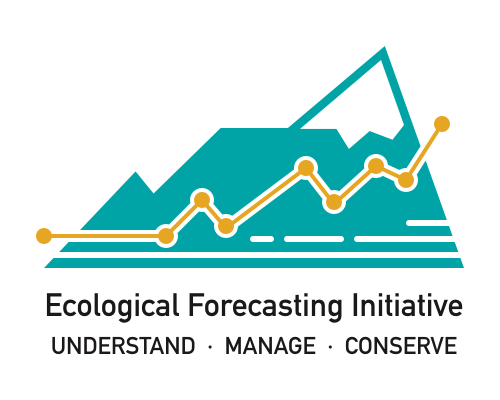

--- 
title: "NEON Ecological Forecasting Challenge"
author: "Ecological Forecasting Initative Research Coordination Network"
date: "2021-04-01"
site: bookdown::bookdown_site
documentclass: book
bibliography: [book.bib]
biblio-style: apalike
link-citations: yes
github-repo: eco4cast/neon4cast-docs
url: 'http\://seankross.com/bookdown-start/'
description: "Documentation for the NEON Ecological Forecasting Challenge"
header-includes:
  - \usepackage{titling}
  - \pretitle{\begin{center}
    \includegraphics[width=2in,height=2in]{images/EFI_Logo-1.jpg}\LARGE\\}
  - \posttitle{\end{center}}
---

# Preface {-}

The NSF funded EFI Research Coordination Network (EFI-RCN) is hosting a NEON Ecological Forecast Challenge with the goal to create a community of practice that builds capacity for ecological forecasting by leveraging NEON data products. The Challenge revolves around the five theme areas listed below that span aquatic and terrestrial systems, and population, community, and ecosystem processes across a broad range of ecoregions that uses data collected by NEON.

As a community, we are excited to learn more about the predictability of ecological processes by forecasting NEON data prior to its release.  What modeling frameworks, mechanistic processes, and statistical approaches best capture community, population, and ecosystem dynamics? These questions are answerable by a community generating a diverse array of forecasts.  The Challenge is open to any individual or team that wants to submit forecasts and includes categories for different career stages. Individuals or team contacts can register to submit forecasts HERE.

The design of the Challenge is the result of contributions of over 200 participants in the May 2020 virtual EFI-RCN meeting, including partner organizations, and the hard work from the Design Teams that have developed the protocols for each of the themes.

Computational resources are supported by NSF funded CyVerse, Jetstream, and XSEDE.

Here are videos from the December 9, 2020 AGU EFI Town Hall providing an overview of 1) of the Challenge, 2) the Challenge cyberinfrastructure, and 3) the NEON data streams.
